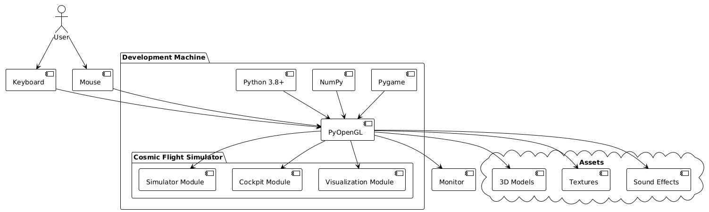

# Architecture Documentation

## System Architecture

### Overview
The Cosmic Flight Simulator is built with a modular architecture to separate concerns and enable easy extension.

### 📊 Viewing Diagrams

Diagrams can be viewed in the following ways:

**Option 1: View embedded PNG images below**
This document includes embedded diagram images in the "Visual Architecture Diagrams" section.

**Option 2: View online using PlantUML renderer**
1. Go to https://www.plantuml.com/plantuml/uml/
2. Copy the PlantUML code from [DIAGRAMS.md](DIAGRAMS.md)
3. Paste and view the rendered diagram

**Option 3: Local rendering with PlantUML**
See [DIAGRAMS.md](DIAGRAMS.md) for instructions on rendering locally.

> **📊 Source Code**: All PlantUML diagram source code is available in [DIAGRAMS.md](DIAGRAMS.md)

## Component Overview

### 1. Simulator Module (`src/simulator/`)
Core physics and simulation logic.

- **physics.py**: Orbital mechanics, thrust simulation, momentum conservation
- **spacecraft.py**: Spacecraft models and properties
- **solar_system.py**: Celestial bodies and gravitational calculations

### 2. Cockpit Module (`src/cockpit/`)
User interface and controls.

- **controls.py**: Input handling and control mapping
- **hud.py**: Heads-up display rendering
- **instruments.py**: Cockpit instrument panels

### 3. Visualization Module (`src/visualization/`)
3D rendering and graphics.

- **renderer.py**: PyOpenGL rendering engine
- **camera.py**: Camera system and views
- **models.py**: 3D model loading and management

## Data Flow

```
User Input -> Controls -> Simulator -> Physics Engine
                    ↓                        ↓
                  Cockpit              Visualization
                    ↓                        ↓
                 Instruments           Camera/Models
```

## Design Patterns

### 1. Component-Based Architecture
Each module is independent with clear interfaces:
- Simulator: Physics calculations
- Cockpit: User interface
- Visualization: Rendering

### 2. Observer Pattern (Planned)
For decoupling components:
- Physics engine publishes state changes
- Cockpit subscribes to updates
- Visualization subscribes to updates

### 3. State Machine (Planned)
For mission flow:
- Tutorial state
- Flight state
- Docking state
- Emergency state

## Dependencies

- **NumPy**: Mathematical calculations
- **Pygame**: Input handling and game loop
- **PyOpenGL**: 3D graphics
- **Pillow**: Texture loading

## Module Responsibilities

### Physics Engine
- Calculate orbital mechanics
- Apply thrust and momentum
- Handle fuel consumption
- Manage gravitational forces

### Cockpit System
- Capture user input
- Display telemetry
- Show instruments
- Manage navigation

### Visualization Engine
- Render 3D models
- Handle camera views
- Display effects
- Manage lighting

## Visual Architecture Diagrams

### System Architecture

*Overview of the complete system showing all modules and data flow*

### Class Diagram

*Core classes and their relationships with properties and methods*

### Data Flow Sequence

*Sequence of operations during user interaction with the simulator*

### Component Interaction

*Runtime interactions between different system components*

### Deployment Architecture

*Technology stack and deployment structure*

### Mission State Flow

*State transitions during mission execution*

## Future Enhancements

1. **Networking**: Multiplayer support
2. **AI**: Autonomous spacecraft
3. **Modding**: Plugin system for extensions
4. **VR Support**: Virtual reality cockpit
5. **Physics**: More realistic orbital mechanics
