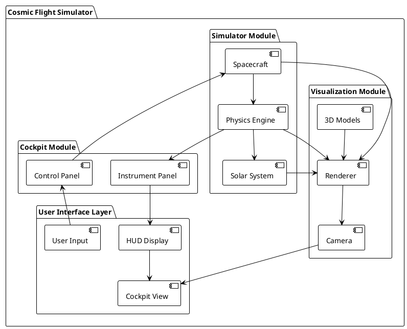
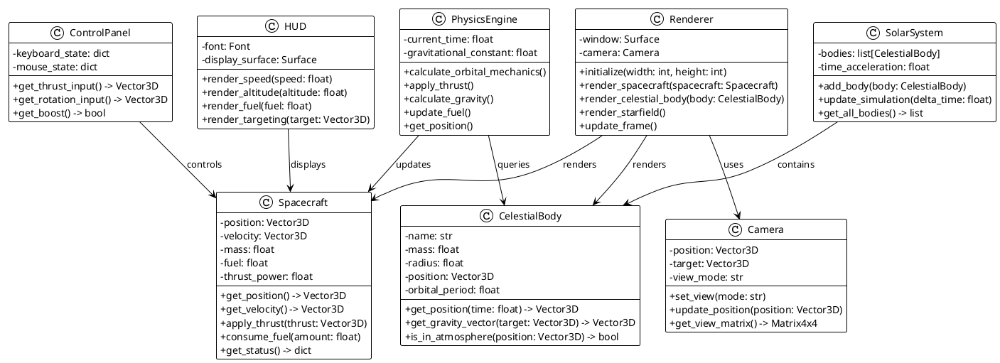
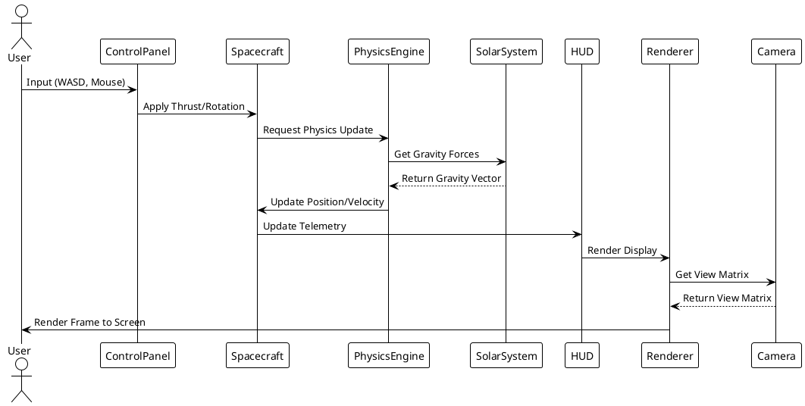
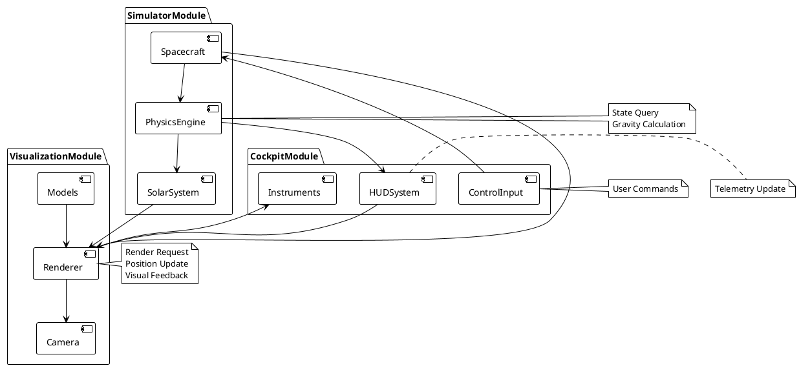
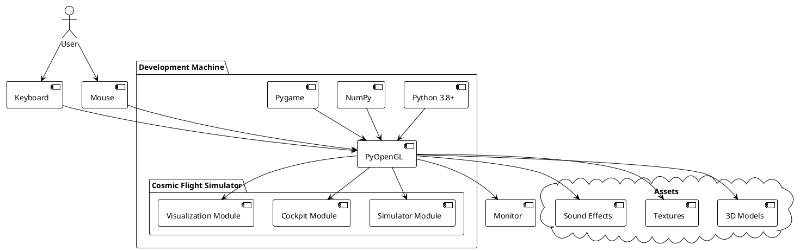
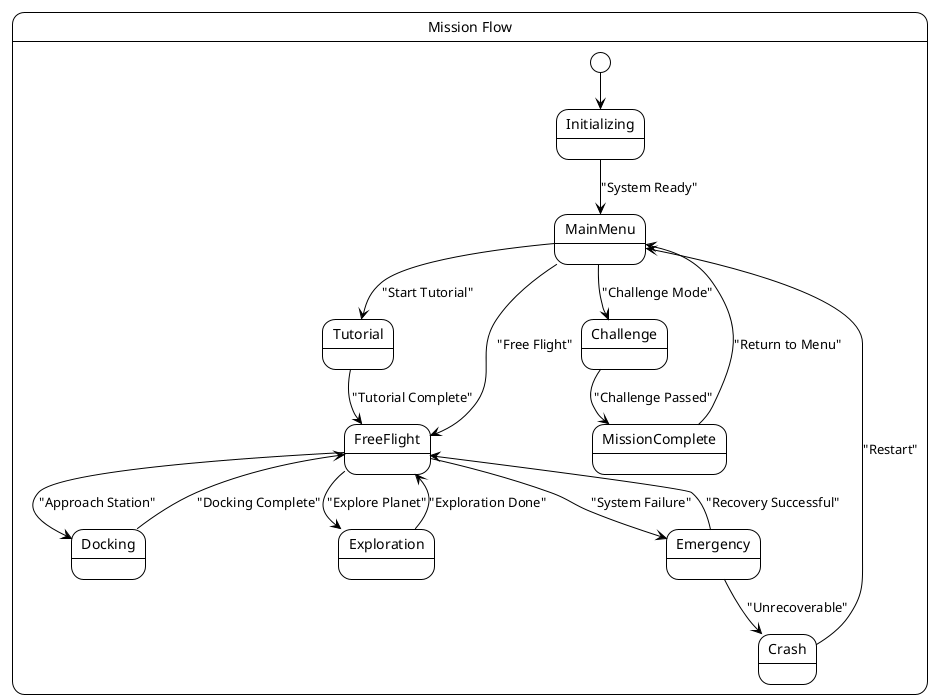

# Cosmic Flight Simulator - Visual Diagrams

This document contains all PlantUML diagrams for the Cosmic Flight Simulator project.

## System Architecture Diagram

This diagram shows the overall system architecture with all modules and their relationships.



## Class Diagram

This diagram defines the core classes and their relationships in the system.



## Data Flow Sequence Diagram

This diagram shows the sequence of operations when a user interacts with the simulator.



## Component Interaction Diagram

This diagram shows how different components interact with each other during runtime.



## Deployment Diagram

This diagram shows the deployment architecture and technology stack.



## State Diagram for Mission Flow

This diagram shows the state transitions during mission execution.



## How to Use These Diagrams

### Prerequisites
To render these PlantUML diagrams, you need:
- Java Runtime Environment (JRE)
- PlantUML jar file
- Or use an online PlantUML renderer

### Online Rendering
1. Copy any diagram code block
2. Visit https://www.plantuml.com/plantuml/uml/
3. Paste the code
4. View the rendered diagram

### Local Rendering
```bash
# Install PlantUML
sudo apt-get install plantuml  # On Ubuntu/Debian

# Or download jar file
wget http://sourceforge.net/projects/plantuml/files/plantuml.jar

# Render diagram
java -jar plantuml.jar DIAGRAMS.md
```

### In VS Code
- Install "PlantUML" extension
- Open any `.puml` or `.md` file with PlantUML code
- Press `Alt+D` to preview
- Or use `Cmd+Shift+P` and select "PlantUML: Preview"
